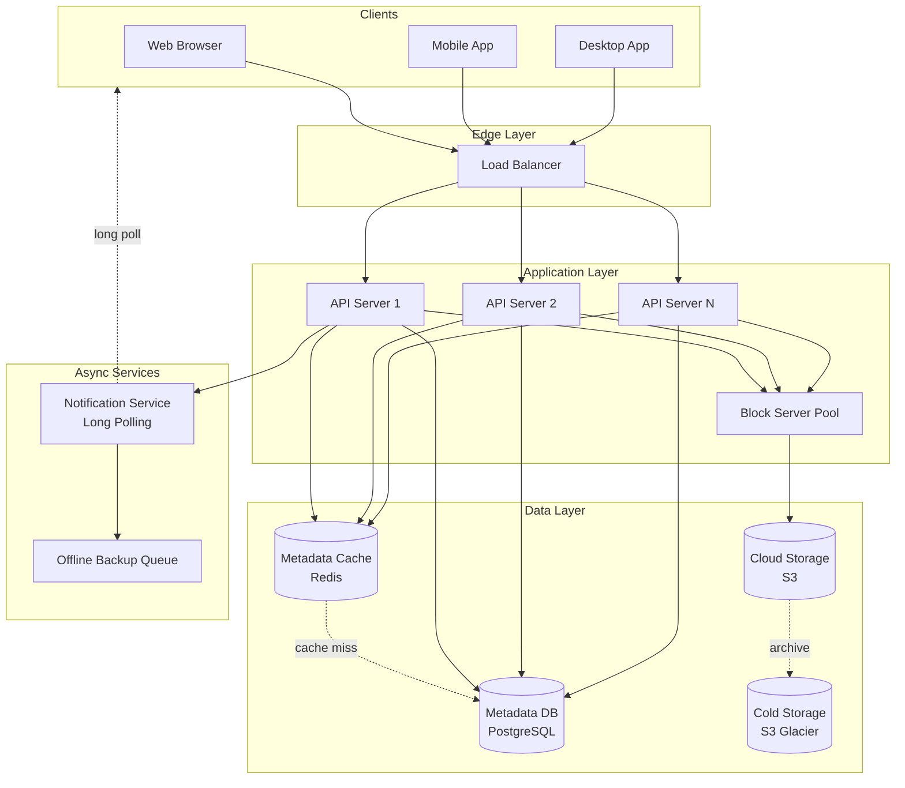
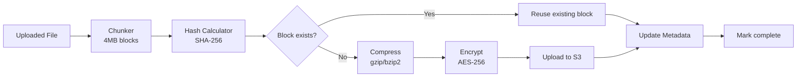
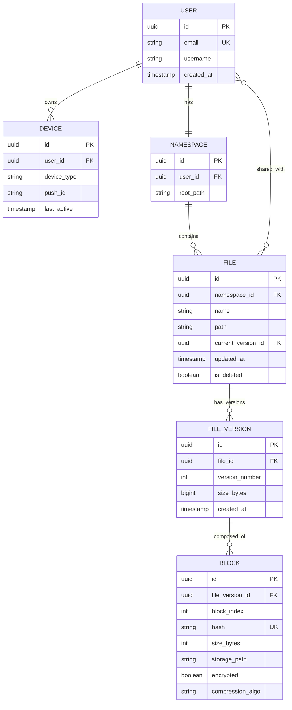
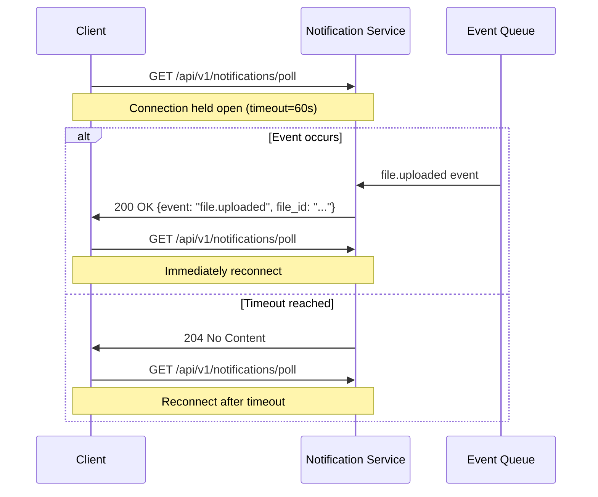
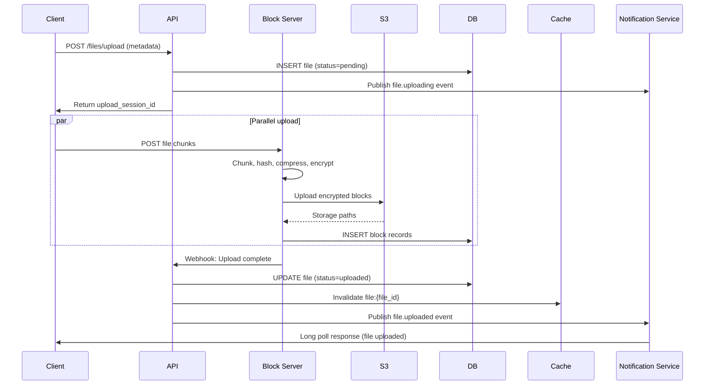
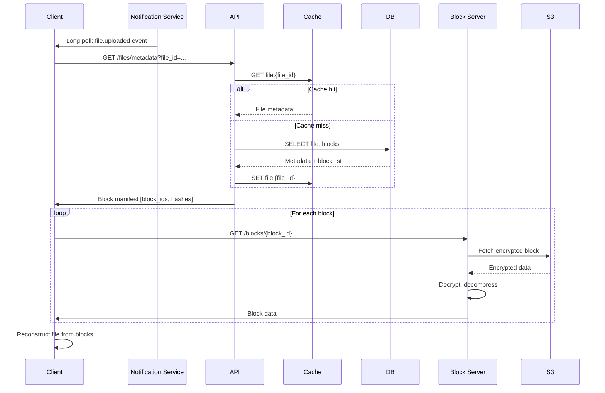
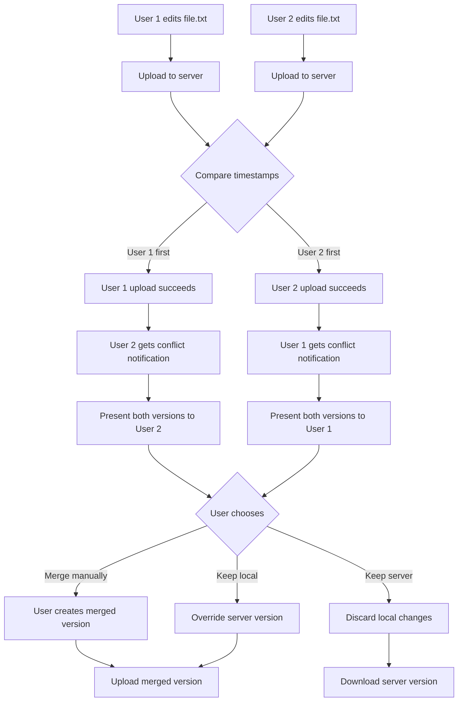

---
tags:
  - system-design
  - google-drive
  - architecture
  - cloud-storage
created: 2025-12-31
status: in-progress
related:
  - "[[00-analysis]]"
---

# Google Drive — Architecture

## High-Level System Diagram



## Component Deep Dive

### Load Balancer

**Purpose**: Distribute incoming requests across API servers, provide high availability

**Implementation**: `nginx` or cloud LB simulation

**Simulates**: AWS Application Load Balancer, HAProxy cluster

> [!info] System Design Concept
> Implements [[horizontal-scaling]] and [[high-availability]]. In production at Google, this would be a multi-layer LB hierarchy with L4 (TCP) and L7 (HTTP) balancing.

**Key decisions**:
- **Algorithm**: Round-robin for stateless API servers
- **Health checks**: Periodic `/health` endpoint polling (5s interval)
- **Session affinity**: Not required (stateless APIs, long poll handled separately)
- **Failover**: Active-passive setup with heartbeat monitoring

**Scaling considerations**:
- At 10K QPS: Single LB sufficient
- At 100K QPS: Multi-AZ LB cluster with DNS-based load distribution
- At 1M QPS: Anycast IP with geographic routing

---

### API Server

**Purpose**: Handle user authentication, metadata CRUD, orchestrate upload/download flows

**Implementation**: `src/api.py` - FastAPI application

**Simulates**: Microservice cluster in production (auth service, file service, sharing service)

> [!info] System Design Concept
> Demonstrates [[stateless-services]] and [[REST-API-design]]. Stateless nature enables easy horizontal scaling without session stickiness.

**Key responsibilities**:
1. **Authentication**: Validate JWT tokens (simulated)
2. **Metadata operations**: File CRUD via database
3. **Upload orchestration**: Coordinate block server + notification flow
4. **Download coordination**: Return block manifest for client reconstruction
5. **Sharing logic**: Manage permissions and shared links

**Endpoints**:

| Method | Path | Purpose | Handler |
|--------|------|---------|---------|
| POST | `/api/v1/auth/login` | User authentication | `auth_handler()` |
| POST | `/api/v1/files/upload` | Initiate upload session | `create_upload_session()` |
| POST | `/api/v1/files/upload?uploadType=resumable` | Resumable upload | `resumable_upload()` |
| GET | `/api/v1/files/download` | Get file blocks | `download_file()` |
| GET | `/api/v1/files/revisions` | List file versions | `list_revisions()` |
| POST | `/api/v1/files/share` | Share file with user | `share_file()` |
| GET | `/api/v1/files/metadata` | Get file metadata | `get_metadata()` |
| DELETE | `/api/v1/files` | Delete file (soft delete) | `delete_file()` |

**Data flow example (Upload)**:
```
1. Client POST /files/upload → API generates upload_session_id
2. API → MetaDB: INSERT file record (status='pending')
3. API → Client: Return upload_session_id + block_server_url
4. Client → Block Server: Stream file with session_id
5. Block Server → API webhook: Upload complete
6. API → MetaDB: UPDATE file (status='uploaded')
7. API → Notification Service: Trigger 'file.uploaded' event
```

---

### Block Server

**Purpose**: Process uploaded files - chunking, compression, encryption, storage

**Implementation**: `src/services/block_processor.py`

**Simulates**: Dedicated upload worker pool (e.g., Celery workers at Dropbox)

> [!info] System Design Concept
> Implements [[delta-sync]], [[data-deduplication]], and [[content-addressable-storage]]. This is the heart of bandwidth optimization.

**Processing pipeline**:



**Chunking algorithm**:
```python
def chunk_file(file_stream, chunk_size=4*1024*1024):
    """Split file into fixed-size blocks (Dropbox approach)"""
    while chunk := file_stream.read(chunk_size):
        block_hash = hashlib.sha256(chunk).hexdigest()
        yield Block(data=chunk, hash=block_hash, size=len(chunk))
```

**Deduplication logic**:
```python
async def store_block(block: Block) -> str:
    """Only upload if block hash doesn't exist"""
    existing = await db.query(Block).filter_by(hash=block.hash).first()
    if existing:
        return existing.storage_path  # Reuse!

    # New block: compress → encrypt → store
    compressed = gzip.compress(block.data)
    encrypted = encrypt_aes256(compressed)
    storage_path = await s3.upload(encrypted)

    await db.add(Block(hash=block.hash, storage_path=storage_path))
    return storage_path
```

**Delta sync implementation**:
```python
async def calculate_delta(old_version_id, new_file_stream):
    """Compare blocks between versions"""
    old_blocks = await db.query(Block).filter_by(version_id=old_version_id).all()
    old_hashes = {b.block_index: b.hash for b in old_blocks}

    new_blocks = list(chunk_file(new_file_stream))

    changed_blocks = []
    for idx, block in enumerate(new_blocks):
        if old_hashes.get(idx) != block.hash:
            changed_blocks.append((idx, block))  # Only upload these!

    return changed_blocks
```

**At scale**:
- Worker pool: 100s of workers processing uploads concurrently
- Queue-based: RabbitMQ/Kafka for job distribution
- Distributed: Workers across multiple datacenters for geo-proximity

---

### Metadata Database

**Purpose**: Store all system metadata - users, files, blocks, versions, sharing

**Implementation**: PostgreSQL with SQLAlchemy ORM

**Simulates**: Sharded relational database cluster (MySQL at Dropbox)

> [!info] System Design Concept
> Demonstrates [[strong-consistency]], [[ACID-properties]], and [[database-indexing]]. Choice of relational DB over NoSQL is intentional for consistency guarantees.

**Schema design**:



**Key indexes**:
```sql
-- Fast user file lookups
CREATE INDEX idx_file_namespace_path ON file(namespace_id, path);

-- Block deduplication
CREATE UNIQUE INDEX idx_block_hash ON block(hash);

-- Version history queries
CREATE INDEX idx_fileversion_file_created ON file_version(file_id, created_at DESC);

-- Sharing lookups
CREATE INDEX idx_share_user_file ON file_share(user_id, file_id);
```

**Consistency strategy**:
- **Write**: All writes to master, synchronous replication to slaves
- **Read**: Reads from slaves OK (metadata cache provides freshness)
- **Cache invalidation**: On write, invalidate cache keys immediately

**Sharding strategy** (at scale):
```
Shard key: user_id (ensures single-user queries hit one shard)
Shard count: 1024 logical shards → 16 physical servers

Example:
- User A (id=12345) → shard_id = 12345 % 1024 = 201 → physical_server_3
- All of User A's data lives on same shard (files, blocks, versions)
```

---

### Metadata Cache

**Purpose**: Reduce database load, accelerate metadata reads

**Implementation**: In-memory dict (production: Redis cluster)

**Simulates**: Distributed cache like Redis Cluster or Memcached

> [!info] System Design Concept
> Implements [[caching-strategies]] (cache-aside pattern) and [[cache-invalidation]]. Critical for meeting latency SLAs at scale.

**Cache-aside pattern**:
```python
async def get_file_metadata(file_id: str) -> FileMetadata:
    # 1. Check cache
    cache_key = f"file:{file_id}"
    if cached := await cache.get(cache_key):
        return FileMetadata.parse(cached)

    # 2. Cache miss → query DB
    file = await db.query(File).filter_by(id=file_id).first()

    # 3. Populate cache (TTL=5min)
    await cache.set(cache_key, file.json(), ttl=300)

    return file
```

**Invalidation strategy**:
```python
async def update_file_metadata(file_id: str, updates: dict):
    # 1. Update database (source of truth)
    await db.update(File).where(id=file_id).values(**updates)

    # 2. Invalidate cache immediately
    await cache.delete(f"file:{file_id}")

    # Alternative: Update cache directly (risk of inconsistency)
    # await cache.set(f"file:{file_id}", updated_file.json())
```

**Cache key design**:
```
file:{file_id} → FileMetadata
user:{user_id}:files → List[FileMetadata]
block:{hash} → BlockMetadata
version:{file_id}:{version_num} → VersionMetadata
```

**At scale**:
- **Cache size**: 10% of DB size (hot data)
- **Eviction**: LRU policy
- **Topology**: Consistent hashing across Redis nodes
- **Replication**: Master-slave per shard

---

### Cloud Storage (S3)

**Purpose**: Durable, scalable object storage for file blocks

**Implementation**: Local filesystem simulation (`storage/` directory)

**Simulates**: Amazon S3 with multi-region replication

> [!info] System Design Concept
> Demonstrates [[object-storage]], [[data-durability]], and [[multi-region-replication]]. S3 provides 99.999999999% (11 nines) durability.

**Storage structure**:
```
storage/
├── blocks/
│   ├── 0a/
│   │   └── 0a3f5c8d...sha256.enc  # Encrypted block
│   ├── 1b/
│   │   └── 1b2e9a7f...sha256.enc
│   └── ...
└── metadata/
    └── manifest.json  # Block → file mapping
```

**Upload flow**:
```python
async def upload_block_to_s3(block: Block, block_hash: str) -> str:
    """
    Simulates S3 multipart upload
    Real implementation: boto3.s3.upload_fileobj()
    """
    # Organize by hash prefix (like S3 partitioning)
    prefix = block_hash[:2]
    filename = f"{block_hash}.enc"
    storage_path = f"blocks/{prefix}/{filename}"

    # Write encrypted block
    async with aiofiles.open(storage_path, 'wb') as f:
        await f.write(block.encrypted_data)

    # S3 returns object key
    return storage_path
```

**Replication simulation**:
```python
# Production: S3 cross-region replication
# Simulation: Duplicate to backup directory
async def replicate_block(storage_path: str):
    primary = f"storage/{storage_path}"
    replica = f"storage-replica/{storage_path}"  # Simulates us-west-2
    await copy_file(primary, replica)
```

**At scale**:
- **Bucket structure**: Partition by user_id or hash prefix
- **Transfer acceleration**: CloudFront CDN for downloads
- **Lifecycle policies**: Auto-archive to Glacier after 90 days
- **Versioning**: S3 native versioning disabled (we manage versions)

---

### Notification Service

**Purpose**: Real-time notification of file changes to connected clients

**Implementation**: `src/services/notification_service.py` - Long polling server

**Simulates**: Production notification infrastructure (WebSocket cluster or long poll servers)

> [!info] System Design Concept
> Implements [[long-polling]] and [[pub-sub-pattern]]. Balances real-time requirements with infrastructure simplicity (vs WebSockets).

**Long polling flow**:



**Implementation**:
```python
class NotificationService:
    def __init__(self):
        self.subscribers: dict[str, asyncio.Queue] = {}  # user_id → event queue

    async def subscribe(self, user_id: str, timeout: int = 60):
        """Long poll: wait for event or timeout"""
        if user_id not in self.subscribers:
            self.subscribers[user_id] = asyncio.Queue()

        queue = self.subscribers[user_id]

        try:
            # Wait for event with timeout
            event = await asyncio.wait_for(queue.get(), timeout=timeout)
            return event
        except asyncio.TimeoutError:
            return None  # No events, client will reconnect

    async def publish(self, user_id: str, event: Event):
        """Notify user of file change"""
        if user_id in self.subscribers:
            await self.subscribers[user_id].put(event)
```

**Event types**:
```python
class EventType(Enum):
    FILE_UPLOADED = "file.uploaded"
    FILE_UPDATED = "file.updated"
    FILE_DELETED = "file.deleted"
    FILE_SHARED = "file.shared"
    SYNC_CONFLICT = "sync.conflict"

@dataclass
class Event:
    event_type: EventType
    file_id: str
    user_id: str
    timestamp: datetime
    metadata: dict
```

**Scalability concerns**:
- **Connection limit**: 1M connections/server (Dropbox scale)
- **Memory**: 1KB/connection → 1GB for 1M users
- **Reconnection storms**: Exponential backoff + jitter on server restart
- **Geo-distribution**: Regional notification servers to reduce latency

---

### Offline Backup Queue

**Purpose**: Store events for offline clients, deliver when they reconnect

**Implementation**: In-memory queue (production: Kafka/SQS)

**Simulates**: Distributed message queue with persistence

> [!info] System Design Concept
> Implements [[message-queuing]] and [[guaranteed-delivery]]. Ensures no events lost even if client offline for days.

**Queue structure**:
```python
class OfflineQueue:
    def __init__(self):
        # user_id → list of pending events
        self.queues: dict[str, list[Event]] = defaultdict(list)
        self.max_queue_size = 1000  # Prevent unbounded growth

    async def enqueue(self, user_id: str, event: Event):
        """Add event for offline user"""
        if len(self.queues[user_id]) < self.max_queue_size:
            self.queues[user_id].append(event)
        else:
            # Drop oldest event (or move to cold storage)
            self.queues[user_id].pop(0)
            self.queues[user_id].append(event)

    async def dequeue_all(self, user_id: str) -> list[Event]:
        """Client came online, fetch all pending events"""
        events = self.queues.pop(user_id, [])
        return events
```

**Persistence strategy** (production):
```python
# Kafka topic: user-events-offline
# Partition key: user_id
# Retention: 7 days

# When client reconnects:
events = await kafka.consume(
    topic="user-events-offline",
    partition_key=user_id,
    from_offset="earliest"
)
```

---

## Data Flow: Upload



**Step-by-step**:
1. Client sends file metadata to API server
2. API creates file record in DB with `status=pending`
3. API returns upload session ID to client
4. Client streams file to block server
5. Block server processes:
   - Split into 4MB chunks
   - Calculate SHA-256 hash per chunk
   - Check if block exists (dedup)
   - If new: compress → encrypt → upload to S3
   - Store block metadata in DB
6. Block server webhooks API: upload complete
7. API updates file status to `uploaded`
8. API invalidates cache for this file
9. API publishes event to notification service
10. Notification service pushes event to subscribed clients

---

## Data Flow: Download



**Step-by-step**:
1. Notification service alerts client: "file X updated"
2. Client requests file metadata from API
3. API checks cache, if miss queries DB
4. API returns block manifest (list of block IDs + hashes)
5. Client downloads each block from block server
6. Block server fetches from S3, decrypts, decompresses
7. Client reassembles file by concatenating blocks in order

---

## Conflict Resolution Flow



**Implementation**:
```python
async def handle_upload_conflict(file_id: str, new_version: FileVersion):
    current = await db.query(File).filter_by(id=file_id).first()

    if new_version.updated_at <= current.updated_at:
        # This upload lost the race
        conflict = SyncConflict(
            file_id=file_id,
            local_version=new_version,
            server_version=current.current_version,
            resolution_options=["merge", "keep_local", "keep_server"]
        )

        # Notify client of conflict
        await notification_service.publish(
            user_id=new_version.user_id,
            event=Event(type="sync.conflict", data=conflict)
        )

        # Store both versions temporarily
        await db.add(new_version)  # Mark as conflicted
        return conflict
```

---

## Performance Optimizations

| Optimization | Technique | Impact |
|--------------|-----------|--------|
| **Delta sync** | Only upload changed blocks | 90% bandwidth reduction on edits |
| **Compression** | gzip (text), specialized (media) | 50-70% size reduction |
| **Deduplication** | Hash-based block reuse | 30% storage savings |
| **Metadata caching** | Redis cache-aside | 99% read latency reduction |
| **Connection pooling** | Reuse DB connections | 10x throughput increase |
| **Async I/O** | Non-blocking uploads/downloads | Handle 10K concurrent users |
| **CDN for downloads** | Edge caching of popular files | 80% latency improvement |
| **Batch notifications** | Coalesce rapid events | Reduce notification spam |

---

## Monitoring & Observability

**Key metrics**:
```python
# Throughput
upload_requests_per_second
download_requests_per_second
block_processing_rate

# Latency
upload_p50_latency_ms
upload_p99_latency_ms
metadata_query_latency_ms

# Errors
upload_failure_rate
sync_conflict_rate
notification_delivery_failure_rate

# Resources
block_server_cpu_utilization
metadata_db_connection_pool_usage
s3_storage_bytes_used

# Business
active_users_count
total_files_count
storage_deduplication_ratio
```

**Alerting thresholds**:
- Upload P99 > 5s → Page on-call
- Sync conflict rate > 5% → Investigate
- DB connection pool > 80% → Scale up

---

**Next**: Proceed to implementation phase with code structure setup.
