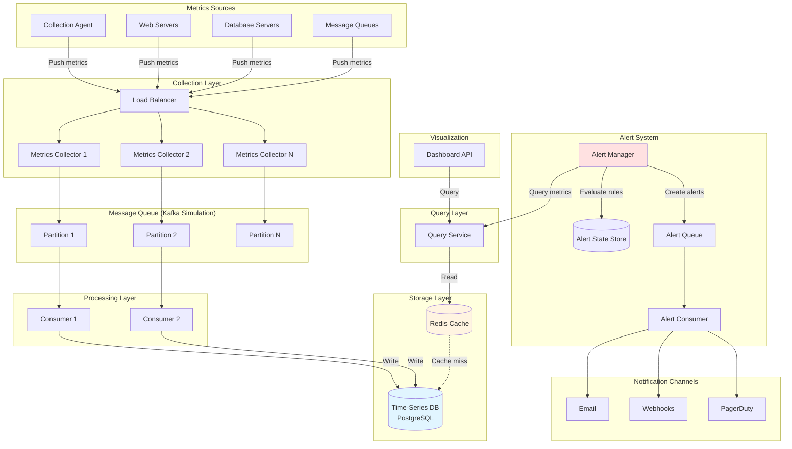
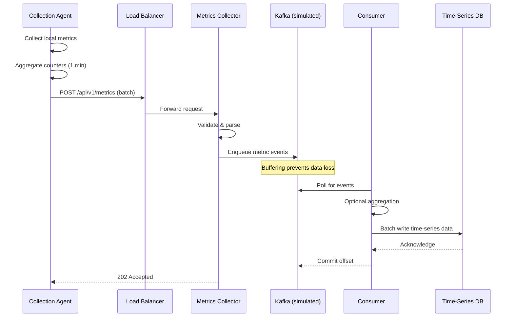
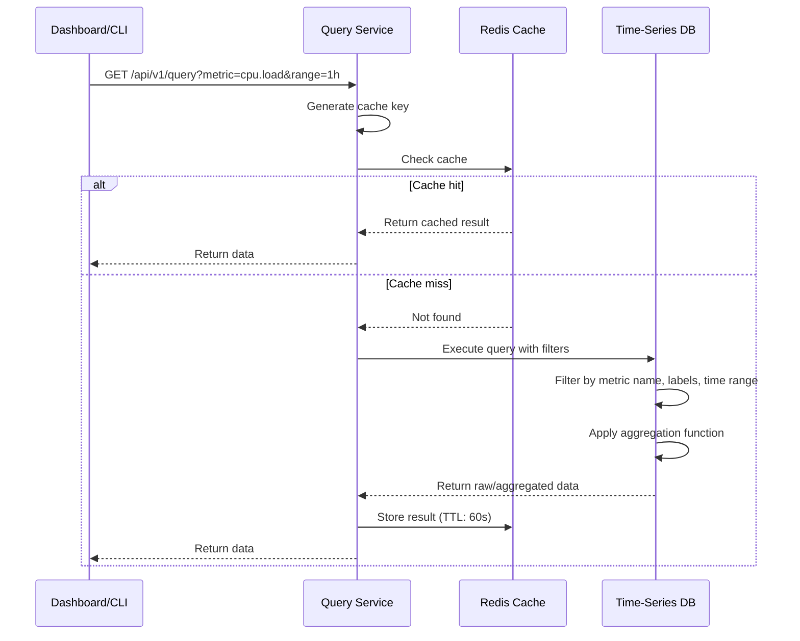
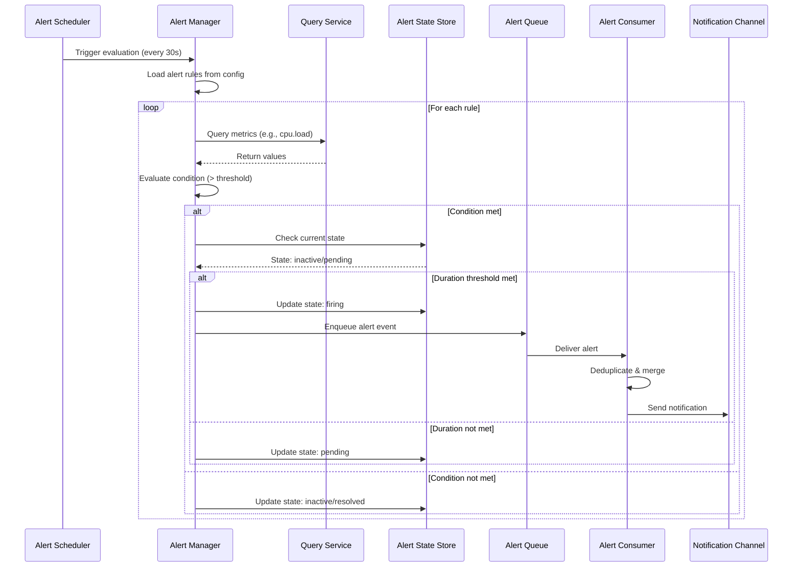
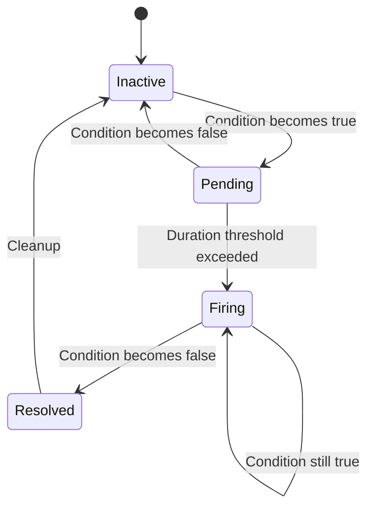
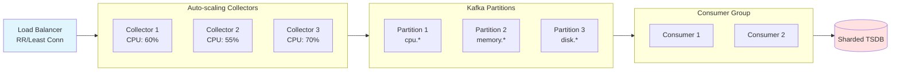
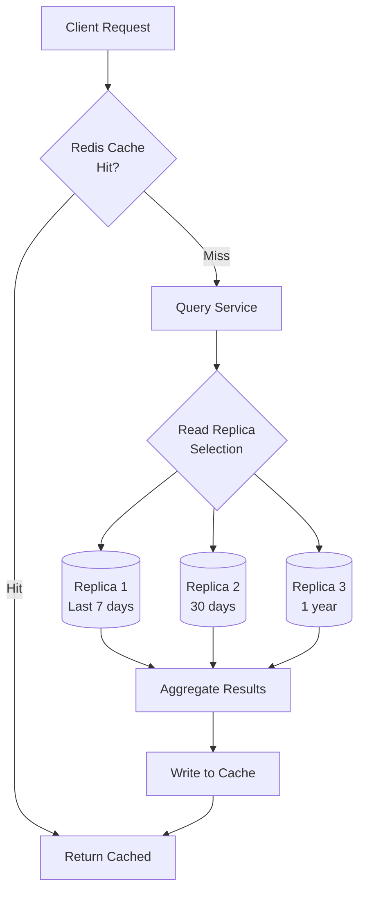
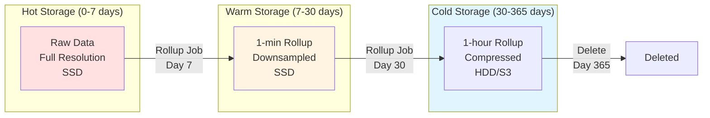
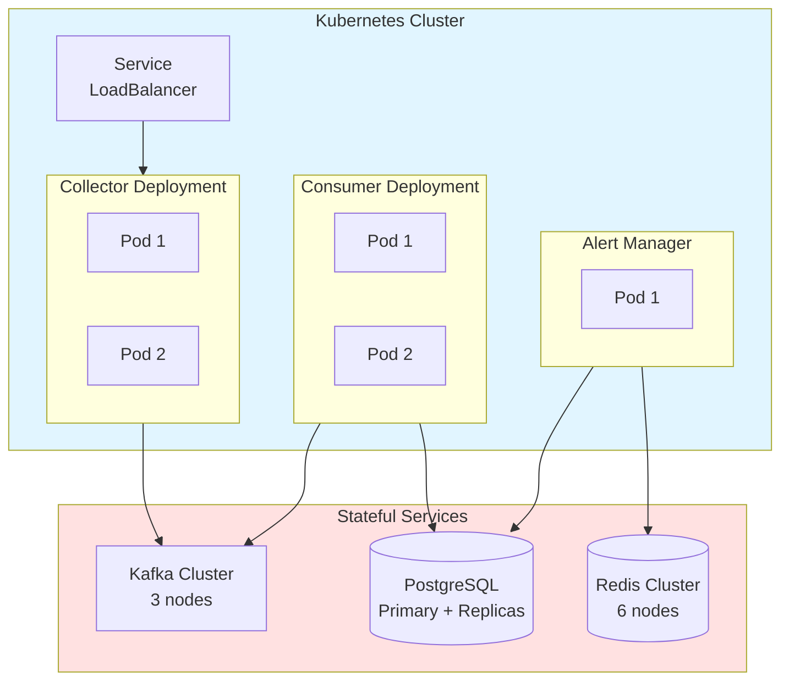

---
tags:
  - system-design
  - metrics-monitoring
  - alerting-system
  - architecture
created: 2026-01-01
related:
  - "[[00-analysis]]"
---

# Metrics Monitoring and Alerting System — Architecture

## High-Level System Diagram



## Detailed Data Flow

### 1. Metrics Ingestion Flow



### 2. Query Flow



### 3. Alert Evaluation Flow



## Component Deep Dive

### Collection Agent

**Purpose**: Runs on each monitored server to collect local metrics and push to collectors
**Implementation**: `src/core/services/collection_agent.py`
**Simulates**: CloudWatch agent, Telegraf, collectd

> [!info] System Design Concept
> This demonstrates [[push-model]] architecture. In production at AWS CloudWatch, agents push metrics to regional endpoints with automatic retry and local buffering.

**Key decisions:**
- **Aggregation**: Simple counters aggregated locally (1-minute windows) to reduce network traffic
- **Batching**: Multiple metrics sent in single HTTP request
- **Fire-and-forget**: 202 Accepted response, no blocking wait
- **Retry logic**: Exponential backoff if collector unavailable

```python
class CollectionAgent:
    """Collects metrics from local system and pushes to collectors.

    Implements local aggregation to reduce network overhead.
    In production, this would be a daemon process with configurable intervals.
    """

    def collect_and_push(self, interval: int = 60):
        metrics = self.collect_system_metrics()
        aggregated = self.aggregate_counters(metrics, window=interval)
        self.push_batch(aggregated, endpoint="/api/v1/metrics")
```

---

### Metrics Collector Cluster

**Purpose**: Receives metrics from agents, validates, and enqueues for processing
**Implementation**: `src/core/views.py` (DRF viewset)
**Simulates**: Prometheus remote write, CloudWatch PutMetricData endpoint

> [!info] System Design Concept
> Demonstrates [[horizontal-scaling]] with load balancer. Collectors are stateless and auto-scale based on CPU/memory.

**Key decisions:**
- **Stateless design**: No local storage, immediate enqueue to Kafka
- **Auto-scaling**: Load balancer distributes across collector pool
- **Validation**: Schema validation via DRF serializers
- **Backpressure handling**: Return 503 if Kafka queue full

**API Contract:**
```json
POST /api/v1/metrics
{
  "metrics": [
    {
      "name": "cpu.load",
      "labels": {"host": "web-01", "region": "us-west"},
      "timestamp": 1613707265,
      "value": 0.75
    }
  ]
}
```

---

### Message Queue (Kafka Simulation)

**Purpose**: Buffers metrics between collection and storage to prevent data loss
**Implementation**: `src/core/models.py::MetricEvent` + background consumer
**Simulates**: Apache Kafka with partitions

> [!info] System Design Concept
> Implements [[message-queue-buffering]] pattern. Decouples producers (collectors) from consumers (storage writers) for reliability.

**Key features:**
- **Partitioning**: Metrics partitioned by metric name for parallel processing
- **Retention**: Events retained until consumed + 1 hour backup
- **Ordering**: Guaranteed ordering within partition (same metric name)
- **Consumer groups**: Multiple consumers for horizontal scaling

**Django model (simplified):**
```python
class MetricEvent(models.Model):
    partition = models.IntegerField()  # Hash(metric_name) % num_partitions
    offset = models.BigIntegerField()  # Sequential per partition
    payload = models.JSONField()       # Metric data
    created_at = models.DateTimeField(auto_now_add=True)
    consumed = models.BooleanField(default=False)
```

---

### Time-Series Database

**Purpose**: Optimized storage for time-series data with efficient queries by labels
**Implementation**: `src/core/models.py::Metric` (PostgreSQL)
**Simulates**: InfluxDB, Prometheus TSDB

> [!info] System Design Concept
> Demonstrates [[time-series-storage]] patterns. Real TSDBs use columnar storage, compression (delta-of-delta), and in-memory caching.

**Schema design:**
```python
class Metric(models.Model):
    name = models.CharField(max_length=255, db_index=True)
    labels = models.JSONField()  # {"host": "web-01", "region": "us-west"}
    timestamp = models.DateTimeField(db_index=True)
    value = models.FloatField()

    class Meta:
        indexes = [
            models.Index(fields=['name', 'timestamp']),
            models.Index(fields=['timestamp']),  # Range queries
        ]
        # Composite index on (name, timestamp) for common query pattern
```

**Optimizations:**
- **Indexes**: Composite index on (name, timestamp) for fast range scans
- **Partitioning strategy**: Could partition by time (monthly tables) at scale
- **Label storage**: JSONB in PostgreSQL for flexible label queries (GIN index)

**At Scale (InfluxDB approach):**
- **Write-Ahead Log (WAL)**: Durable writes before in-memory cache
- **Time-Structured Merge Tree (TSM)**: Columnar storage engine
- **Compression**: Delta-of-delta encoding reduces storage by 10-20x
- **Sharding**: Data split across nodes by time range + series hash

---

### Query Service

**Purpose**: Unified interface for querying metrics with caching
**Implementation**: `src/core/services/query_service.py`
**Simulates**: PromQL query engine, InfluxDB query API

> [!info] System Design Concept
> Shows [[query-optimization]] with caching layer. Real systems compile queries to efficient execution plans.

**Features:**
- **Time-range filters**: Start/end timestamps
- **Label matching**: Filter by exact label values or regex
- **Aggregation functions**: avg(), sum(), max(), min(), count()
- **Grouping**: Group by label keys
- **Cache integration**: Redis cache with TTL based on query recency

**Example queries:**
```python
# Average CPU across all web servers in last hour
query_service.query(
    metric_name="cpu.load",
    labels={"role": "web"},
    start_time=now - timedelta(hours=1),
    aggregation="avg"
)

# 95th percentile response time, grouped by region
query_service.query(
    metric_name="http.response_time",
    start_time=now - timedelta(hours=24),
    aggregation="percentile",
    percentile=95,
    group_by=["region"]
)
```

**Cache key strategy:**
```python
cache_key = f"metrics:{metric_name}:{labels_hash}:{start}:{end}:{agg}"
ttl = 60 if (now - end) < 1hour else 3600  # Recent data cached shorter
```

---

### Alert Manager

**Purpose**: Evaluates alert rules and manages alert lifecycle
**Implementation**: `src/core/services/alert_manager.py`
**Simulates**: Prometheus Alertmanager

> [!info] System Design Concept
> Implements [[alert-state-machine]] with deduplication. Production systems handle alert fatigue, flapping, and notification routing.

**Alert States:**


**Rule format (YAML):**
```yaml
groups:
  - name: infrastructure_alerts
    interval: 30s  # Evaluation frequency
    rules:
      - alert: HighCPUUsage
        expr: "cpu.load > 0.8"
        for: 5m  # Must be true for 5 minutes
        labels:
          severity: warning
          team: infrastructure
        annotations:
          summary: "High CPU on {{ host }}"
          description: "CPU load is {{ value }} on host {{ host }}"
```

**Deduplication logic:**
```python
def deduplicate_alerts(alerts: List[Alert]) -> List[Alert]:
    """
    Merge alerts with same fingerprint (name + labels).
    Example: 10 servers with high CPU → 1 alert with count=10
    """
    grouped = {}
    for alert in alerts:
        fingerprint = hash(alert.name, alert.labels)
        if fingerprint in grouped:
            grouped[fingerprint].count += 1
        else:
            grouped[fingerprint] = alert
    return list(grouped.values())
```

**Key features:**
- **Rule evaluation**: Periodic queries to Query Service
- **State persistence**: Alert states stored in database (survive restarts)
- **Retry mechanism**: Failed notifications retried with exponential backoff
- **Silencing**: Temporary muting of alerts (not implemented in MVP)

---

### Notification Service

**Purpose**: Sends alerts to multiple channels with retry logic
**Implementation**: `src/core/services/notification_service.py`
**Simulates**: Multi-channel notification dispatcher

**Supported channels:**
- **Email**: SMTP (mocked with logging)
- **Webhook**: HTTP POST to custom endpoints
- **PagerDuty**: API integration (mocked)

**Delivery guarantees:**
```python
class NotificationService:
    """
    Ensures at-least-once delivery with retry.
    Uses exponential backoff for transient failures.
    """

    def send_with_retry(self, alert: Alert, channel: str, max_retries=3):
        for attempt in range(max_retries):
            try:
                self.send(alert, channel)
                self.mark_delivered(alert, channel)
                break
            except TransientError:
                sleep(2 ** attempt)  # Exponential backoff
            except PermanentError:
                self.mark_failed(alert, channel)
                break
```

---

### Dashboard API

**Purpose**: Provides data endpoints for visualization
**Implementation**: `src/core/views.py::DashboardViewSet`
**Simulates**: Grafana data source API

**Endpoints:**
```
GET /api/v1/dashboard/metrics            # List available metrics
GET /api/v1/dashboard/query              # Time-series data for graphs
GET /api/v1/dashboard/labels             # Available label keys/values
GET /api/v1/dashboard/alerts             # Active alerts
```

**Graph data format:**
```json
{
  "metric": "cpu.load",
  "labels": {"host": "web-01"},
  "datapoints": [
    [0.75, 1613707200000],
    [0.82, 1613707260000],
    [0.79, 1613707320000]
  ]
}
```

---

## Data Models

### Core Metric Model

```python
class Metric(models.Model):
    """
    Time-series data point.

    Represents a single observation at a specific point in time.
    In InfluxDB, this would be stored in a measurement with tags and fields.
    """
    name = models.CharField(max_length=255, db_index=True)
    labels = models.JSONField(default=dict)  # Tags/dimensions
    timestamp = models.DateTimeField(db_index=True)
    value = models.FloatField()

    # Metadata
    created_at = models.DateTimeField(auto_now_add=True)

    class Meta:
        indexes = [
            models.Index(fields=['name', 'timestamp']),
            models.Index(fields=['timestamp', 'name']),
        ]
        ordering = ['-timestamp']
```

### Alert Rule Model

```python
class AlertRule(models.Model):
    """
    Defines conditions that trigger alerts.

    Loaded from YAML configuration but persisted in DB
    for runtime modification and state tracking.
    """
    name = models.CharField(max_length=255, unique=True)
    metric_name = models.CharField(max_length=255)
    condition = models.CharField(max_length=50)  # >, <, ==, !=
    threshold = models.FloatField()
    duration = models.DurationField()  # How long condition must be true
    labels = models.JSONField(default=dict)  # Filter labels
    severity = models.CharField(max_length=50)

    # Notification settings
    channels = models.JSONField(default=list)  # ["email", "pagerduty"]

    enabled = models.BooleanField(default=True)
    created_at = models.DateTimeField(auto_now_add=True)
```

### Alert Instance Model

```python
class AlertInstance(models.Model):
    """
    A specific firing of an alert rule.

    Tracks state transitions and notification history.
    """
    STATE_CHOICES = [
        ('inactive', 'Inactive'),
        ('pending', 'Pending'),
        ('firing', 'Firing'),
        ('resolved', 'Resolved'),
    ]

    rule = models.ForeignKey(AlertRule, on_delete=models.CASCADE)
    fingerprint = models.CharField(max_length=64, db_index=True)  # Hash of rule + labels
    state = models.CharField(max_length=20, choices=STATE_CHOICES)

    # State timestamps
    pending_since = models.DateTimeField(null=True)
    firing_since = models.DateTimeField(null=True)
    resolved_at = models.DateTimeField(null=True)

    # Current values
    current_value = models.FloatField()
    labels = models.JSONField(default=dict)  # Actual labels from metrics

    # Notification tracking
    notifications_sent = models.IntegerField(default=0)
    last_notification_at = models.DateTimeField(null=True)

    updated_at = models.DateTimeField(auto_now=True)
```

---

## API Endpoints

| Method | Path | Purpose | Request Body | Response |
|--------|------|---------|--------------|----------|
| POST | `/api/v1/metrics` | Ingest metrics batch | `{"metrics": [...]}`  | `202 Accepted` |
| GET | `/api/v1/query` | Query time-series data | Query params | `{"results": [...]}` |
| GET | `/api/v1/metrics/names` | List metric names | - | `["cpu.load", ...]` |
| GET | `/api/v1/metrics/labels` | List label keys/values | `?metric=cpu.load` | `{"host": ["web-01", ...]}` |
| POST | `/api/v1/alerts/rules` | Create alert rule | YAML/JSON rule | `201 Created` |
| GET | `/api/v1/alerts/rules` | List alert rules | - | `[{rule}, ...]` |
| GET | `/api/v1/alerts/active` | Get firing alerts | - | `[{alert}, ...]` |
| POST | `/api/v1/alerts/test` | Test alert rule | Rule definition | `{"would_fire": bool}` |
| GET | `/api/v1/dashboard/metrics` | Dashboard data source | Time range params | Time-series data |

---

## Scaling Strategies

### Write Path Scaling



**Key points:**
- **Collectors**: Stateless, scale horizontally based on CPU metrics
- **Kafka partitions**: Partition by metric name for parallelism
- **Consumers**: One consumer per partition for ordering guarantees
- **Database sharding**: Shard by (metric_name, time_range) at massive scale

### Read Path Scaling



**Optimizations:**
- **Multi-tier caching**: L1 in-memory (recent queries), L2 Redis (shared)
- **Read replicas**: Route queries to replicas by time range
- **Materialized views**: Pre-computed aggregations for common queries
- **Query result streaming**: Large result sets streamed incrementally

---

## Data Retention Implementation

### Tiered Storage Strategy



**Rollup logic (simplified):**
```python
def rollup_to_1min_resolution(start_date, end_date):
    """
    Aggregate 10-second data into 1-minute buckets.
    Computes avg, max, min for each metric.
    """
    raw_data = Metric.objects.filter(
        timestamp__gte=start_date,
        timestamp__lt=end_date
    )

    for metric_name in raw_data.values_list('name', flat=True).distinct():
        for bucket_start in time_buckets(start_date, end_date, interval=60):
            bucket_end = bucket_start + timedelta(seconds=60)

            agg = raw_data.filter(
                name=metric_name,
                timestamp__gte=bucket_start,
                timestamp__lt=bucket_end
            ).aggregate(
                avg_value=Avg('value'),
                max_value=Max('value'),
                min_value=Min('value'),
                count=Count('id')
            )

            AggregatedMetric.objects.create(
                name=metric_name,
                timestamp=bucket_start,
                resolution='1m',
                **agg
            )
```

---

## Performance Characteristics

| Operation | Latency Target | Throughput | Bottleneck |
|-----------|---------------|------------|------------|
| Metrics ingestion (batch) | < 50ms p99 | 100K writes/sec | Network I/O, Kafka write |
| Query (cached) | < 10ms | 10K queries/sec | Redis network |
| Query (uncached, recent) | < 100ms | 1K queries/sec | DB index scan |
| Query (uncached, 1 year) | < 500ms | 100 queries/sec | Disk I/O |
| Alert evaluation | < 1s per rule | 1000 rules/min | Query service load |
| Notification delivery | < 5s | 100 alerts/sec | External API limits |

---

## Deployment Architecture



**Deployment considerations:**
- **Horizontal Pod Autoscaling**: Scale collectors/consumers based on CPU/memory
- **StatefulSets**: Kafka, PostgreSQL, Redis with persistent volumes
- **Health checks**: Liveness/readiness probes on all services
- **Resource limits**: CPU/memory limits to prevent resource exhaustion

---

**Status**: Architecture design complete. Ready to proceed with Django project setup and implementation.
