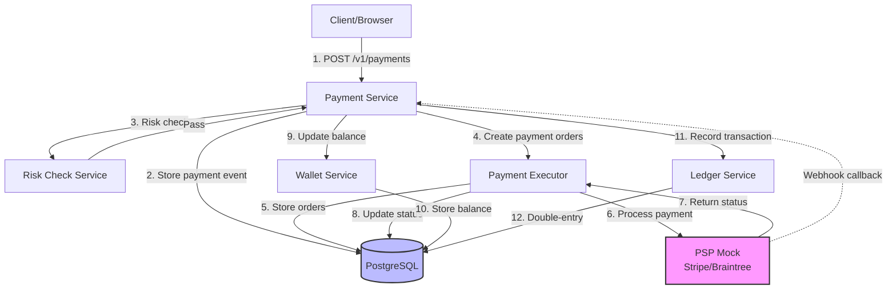
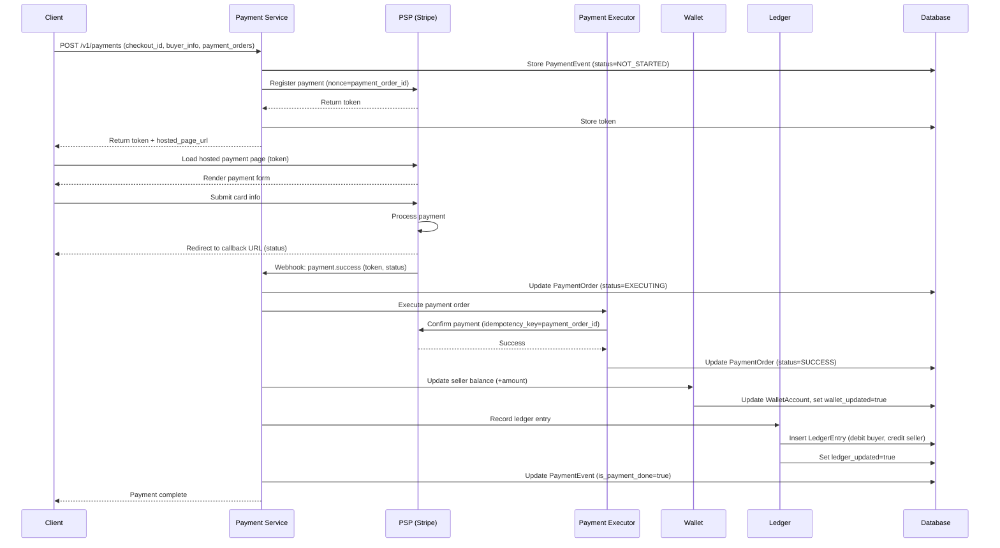
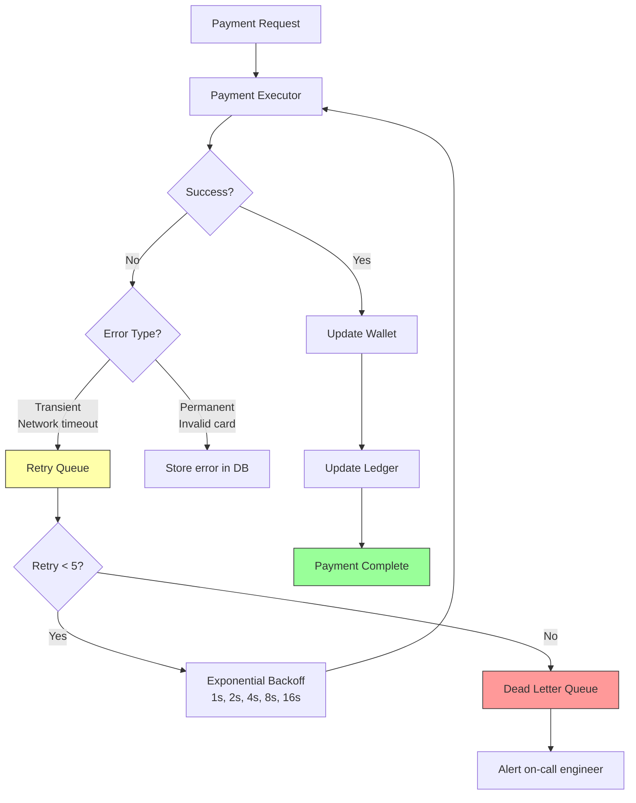
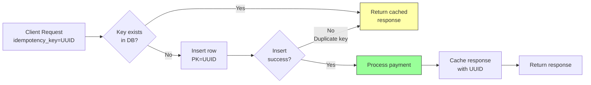
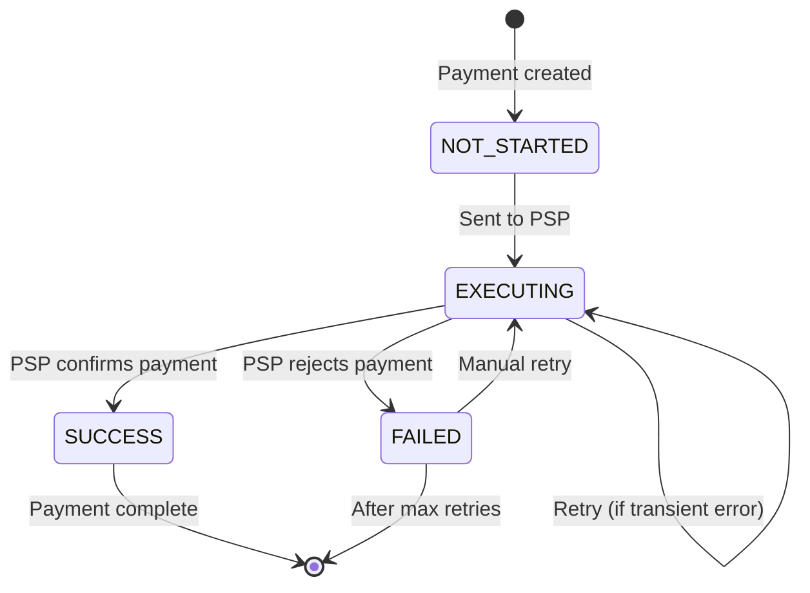

---
tags:
  - system-design
  - payment-system
  - architecture
created: 2026-01-01
related:
  - "[[00-analysis]]"
---

# Payment System — Architecture

## System Diagram

### High-Level Pay-in Flow



### Detailed Payment Flow with Hosted Payment Page



### Retry and Error Handling Flow



### Idempotency Flow



## Component Deep Dive

### Payment Service

**Purpose**: Orchestrates the entire payment lifecycle from checkout to ledger recording
**Implementation**: `core/services/payment_service.py`
**Simulates**: Stripe Payment Intents API, PayPal Checkout API

> [!info] System Design Concept
> This demonstrates [[orchestration-pattern]] and [[saga-pattern]]. In production at Stripe, this would be a distributed saga coordinator managing multi-service transactions without 2PC (two-phase commit).

**Key decisions:**
- Uses **local transactions** for single-service updates (Django's `@transaction.atomic`)
- Updates wallet/ledger **asynchronously** to prevent blocking on failures
- Tracks state with `payment_order_status` enum (NOT_STARTED → EXECUTING → SUCCESS/FAILED)

**API**: See "API Endpoints" section below

---

### Payment Executor

**Purpose**: Executes individual payment orders by calling the PSP
**Implementation**: `core/services/payment_executor.py`
**Simulates**: Payment gateway adapter (abstracts PSP differences)

> [!info] System Design Concept
> Implements [[adapter-pattern]] to decouple from specific PSP implementations. Also demonstrates [[idempotency]] by using `payment_order_id` as the idempotency key sent to PSP.

**Key decisions:**
- Retries transient failures (network errors, timeouts) up to 5 times
- Uses exponential backoff (1s, 2s, 4s, 8s, 16s)
- Stores PSP response tokens for reconciliation

---

### PSP Mock (Stripe/Braintree Simulator)

**Purpose**: Simulates third-party payment processor API
**Implementation**: `core/services/psp_mock.py`
**Simulates**: Stripe API, Braintree API, card schemes (Visa/MasterCard)

> [!info] System Design Concept
> This is a simplified version of how Stripe processes payments. Real PSPs interface with card schemes (Visa/MasterCard) and acquiring banks. We simulate the key behaviors: registration, hosted pages, webhooks.

**Key behaviors:**
- `register_payment()`: Returns nonce/token pair (simulates Stripe Checkout Session)
- `process_payment()`: 90% success rate, 10% random failures
- `webhook_callback()`: Async notification of payment status
- Respects idempotency keys (duplicate requests return cached response)

---

### Wallet Service

**Purpose**: Manages account balances for buyers and sellers
**Implementation**: `core/services/wallet_service.py`
**Simulates**: Digital wallet system (Stripe Connect balances, PayPal wallet)

> [!info] System Design Concept
> Demonstrates [[optimistic-locking]] for concurrent balance updates. Uses database row-level locks (`SELECT FOR UPDATE`) to prevent race conditions.

**Key decisions:**
- Balances stored in cents (integers) to avoid floating-point errors
- Updates are **idempotent** (check `wallet_updated` flag before applying)
- No overdraft protection in MVP (seller can go negative)

---

### Ledger Service

**Purpose**: Maintains double-entry accounting records
**Implementation**: `core/services/ledger_service.py`
**Simulates**: Immutable financial ledger (Square's accounting database [reference](https://developer.squareup.com/blog/books-an-immutable-double-entry-accounting-database-service/))

> [!info] System Design Concept
> Implements [[double-entry-accounting]]. Every transaction creates two entries: debit one account, credit another. Sum of all entries must = 0. This provides end-to-end traceability and detects inconsistencies.

**Key decisions:**
- Ledger entries are **append-only** (never updated or deleted)
- Each entry has `transaction_id` linking debit/credit pairs
- Schema: `LedgerEntry(account, debit_cents, credit_cents, transaction_id)`
- Uses PostgreSQL's `CHECK` constraint to ensure `debit_cents + credit_cents > 0`

**Example**:
```
Transaction: Buyer pays $10 to Seller

Entry 1: account=buyer,   debit=1000,  credit=0,    tx_id=abc123
Entry 2: account=seller,  debit=0,     credit=1000, tx_id=abc123

Sum: 1000 - 1000 = 0 ✓
```

---

### Reconciliation Service

**Purpose**: Nightly job to compare ledger vs wallet vs PSP settlement files
**Implementation**: `core/services/reconciliation_service.py`
**Simulates**: Financial reconciliation system (banks send settlement files)

> [!info] System Design Concept
> Demonstrates [[eventual-consistency]]. In distributed systems with external dependencies, strong consistency is impossible. Reconciliation is the "last line of defense" to detect discrepancies.

**How it works:**
1. PSP sends settlement file (CSV) with all transactions
2. Compare PSP records vs our ledger entries
3. Identify mismatches (missing transactions, amount differences)
4. Alert finance team for manual investigation

**Mismatch categories** (from chapter):
- **Classifiable + automatable**: Auto-fix with script
- **Classifiable + manual**: Add to finance team queue
- **Unclassifiable**: Flag for investigation

---

### Risk Check Service

**Purpose**: Anti-fraud and compliance checks (AML/CFT)
**Implementation**: `core/services/risk_check.py`
**Simulates**: Third-party risk providers (Sift, Stripe Radar)

> [!warning] Simplified for Demo
> Real risk checks analyze user behavior, device fingerprints, transaction patterns. Our mock always returns PASS for demo purposes.

**Real-world checks:**
- Address Verification System (AVS)
- Card Verification Value (CVV)
- 3D Secure authentication
- Velocity checks (transactions per hour)
- Blocklist matching

---

## Data Flow (Step-by-Step)

### Pay-in Flow Detailed Steps

1. **Client initiates checkout**
   - User clicks "Place Order" button
   - Client sends `POST /v1/payments` with checkout_id, buyer_info, payment_orders[]

2. **Payment service stores event**
   - Insert `PaymentEvent` row (status=NOT_STARTED)
   - Generate UUID for each payment order

3. **Risk check**
   - Call risk check service with transaction details
   - If FAIL, reject payment and return error
   - If PASS, continue

4. **Register with PSP**
   - For each payment order, call `PSP.register_payment(nonce=payment_order_id)`
   - PSP returns `token` (UUID on PSP side)
   - Store token in database

5. **Return hosted payment page**
   - Client receives `token` and `hosted_page_url`
   - Client redirects user to PSP's payment form

6. **User submits payment**
   - User enters card details on PSP-hosted page
   - PSP processes payment (contacts card scheme/banks)
   - PSP redirects user to merchant's callback URL

7. **Webhook notification**
   - PSP calls `POST /webhooks/payment-status` with payment status
   - Payment service updates `PaymentOrder.status = EXECUTING`

8. **Execute payment**
   - Payment executor calls `PSP.process_payment(idempotency_key=payment_order_id)`
   - PSP returns SUCCESS or FAILED
   - Update `PaymentOrder.status = SUCCESS/FAILED`

9. **Update wallet** (if SUCCESS)
   - Call `Wallet.update_balance(seller_id, +amount)`
   - Set `PaymentOrder.wallet_updated = true`

10. **Record in ledger** (if SUCCESS)
    - Call `Ledger.record_transaction(debit=buyer, credit=seller, amount)`
    - Creates two LedgerEntry rows (double-entry)
    - Set `PaymentOrder.ledger_updated = true`

11. **Mark complete**
    - Update `PaymentEvent.is_payment_done = true`
    - Return success response to client

---

## API Endpoints

### Payment Service API

#### 1. Execute Payment Event

**Endpoint**: `POST /api/v1/payments`

**Description**: Creates a payment event with one or more payment orders

**Request Body**:
```json
{
  "buyer_info": {
    "user_id": "user_123",
    "email": "buyer@example.com",
    "name": "John Doe"
  },
  "checkout_id": "checkout_abc123",
  "credit_card_info": {
    "token": "tok_visa_4242",
    "last4": "4242"
  },
  "payment_orders": [
    {
      "payment_order_id": "order_xyz789",
      "seller_account": "seller_456",
      "amount": "29.99",
      "currency": "USD"
    }
  ]
}
```

**Response** (202 Accepted):
```json
{
  "checkout_id": "checkout_abc123",
  "payment_event_status": "PROCESSING",
  "payment_orders": [
    {
      "payment_order_id": "order_xyz789",
      "status": "EXECUTING",
      "psp_token": "tok_1234567890abcdef"
    }
  ],
  "created_at": "2026-01-01T12:00:00Z"
}
```

**Idempotency**: Uses `checkout_id` as idempotency key. Duplicate requests return same response.

---

#### 2. Get Payment Status

**Endpoint**: `GET /api/v1/payments/{payment_order_id}`

**Description**: Returns execution status of a single payment order

**Response**:
```json
{
  "payment_order_id": "order_xyz789",
  "status": "SUCCESS",
  "amount": "29.99",
  "currency": "USD",
  "buyer_account": "user_123",
  "seller_account": "seller_456",
  "wallet_updated": true,
  "ledger_updated": true,
  "created_at": "2026-01-01T12:00:00Z",
  "updated_at": "2026-01-01T12:00:05Z"
}
```

**Status Values**: `NOT_STARTED`, `EXECUTING`, `SUCCESS`, `FAILED`

---

#### 3. Webhook (PSP Callback)

**Endpoint**: `POST /api/v1/webhooks/payment-status`

**Description**: Receives payment status updates from PSP

**Request Body**:
```json
{
  "token": "tok_1234567890abcdef",
  "status": "success",
  "payment_order_id": "order_xyz789",
  "timestamp": "2026-01-01T12:00:03Z",
  "signature": "sha256_hmac_signature"
}
```

**Response**: `200 OK`

> [!warning] Security
> In production, verify `signature` using HMAC-SHA256 with shared secret to prevent spoofed webhooks.

---

## Data Models

### PaymentEvent

**Purpose**: Represents a single checkout session (may contain multiple orders)

```python
class PaymentEvent(models.Model):
    """
    Payment event for a checkout session.

    System Design Concept:
        Demonstrates [[aggregate-root]] pattern in DDD. The PaymentEvent
        is the aggregate root containing multiple PaymentOrder entities.
    """
    checkout_id = models.CharField(max_length=255, primary_key=True)
    buyer_info = models.JSONField()  # {user_id, email, name}
    seller_info = models.JSONField(null=True, blank=True)
    credit_card_info = models.JSONField()  # {token, last4} - NO raw card data
    is_payment_done = models.BooleanField(default=False)
    created_at = models.DateTimeField(auto_now_add=True)
    updated_at = models.DateTimeField(auto_now=True)
```

---

### PaymentOrder

**Purpose**: Individual payment from buyer to seller (part of a checkout)

```python
class PaymentOrder(models.Model):
    """
    Individual payment order within a payment event.

    System Design Concept:
        The payment_order_id is used as the [[idempotency-key]] for both
        our system and the PSP. This ensures exactly-once payment processing.
    """

    class Status(models.TextChoices):
        NOT_STARTED = 'NOT_STARTED'
        EXECUTING = 'EXECUTING'
        SUCCESS = 'SUCCESS'
        FAILED = 'FAILED'

    payment_order_id = models.CharField(max_length=255, primary_key=True)
    checkout = models.ForeignKey(PaymentEvent, on_delete=models.CASCADE, related_name='orders')
    buyer_account = models.CharField(max_length=255)
    seller_account = models.CharField(max_length=255)
    amount = models.CharField(max_length=50)  # String to avoid float precision issues
    currency = models.CharField(max_length=3)  # ISO 4217 (USD, EUR, etc.)

    status = models.CharField(max_length=20, choices=Status.choices, default=Status.NOT_STARTED)
    psp_token = models.CharField(max_length=255, null=True, blank=True)

    wallet_updated = models.BooleanField(default=False)
    ledger_updated = models.BooleanField(default=False)

    retry_count = models.IntegerField(default=0)
    error_message = models.TextField(null=True, blank=True)

    created_at = models.DateTimeField(auto_now_add=True)
    updated_at = models.DateTimeField(auto_now=True)

    class Meta:
        indexes = [
            models.Index(fields=['status', 'created_at']),  # For monitoring dashboard
            models.Index(fields=['seller_account']),  # For seller queries
        ]
```

---

### WalletAccount

**Purpose**: Account balance for users and merchants

```python
class WalletAccount(models.Model):
    """
    Digital wallet for storing account balances.

    System Design Concept:
        Uses [[optimistic-locking]] with database row-level locks to prevent
        race conditions during concurrent balance updates.

    At Scale:
        Balances would be cached in Redis with write-through policy.
        Use sharding by account_id for horizontal scaling.
    """
    account_id = models.CharField(max_length=255, primary_key=True)
    balance_cents = models.BigIntegerField(default=0)  # Store in cents to avoid float errors
    currency = models.CharField(max_length=3, default='USD')

    created_at = models.DateTimeField(auto_now_add=True)
    updated_at = models.DateTimeField(auto_now=True)

    class Meta:
        constraints = [
            models.CheckConstraint(
                check=models.Q(balance_cents__gte=-1000000),  # Allow -$10k overdraft for demo
                name='balance_not_too_negative'
            )
        ]
```

---

### LedgerEntry

**Purpose**: Immutable double-entry accounting records

```python
class LedgerEntry(models.Model):
    """
    Immutable ledger entry for double-entry accounting.

    System Design Concept:
        Implements [[double-entry-accounting]]. Every transaction creates
        TWO entries: one debit, one credit. Sum of all entries must equal zero.

    Simulates:
        Square's immutable accounting database service.

    At Scale:
        Use append-only log (like Kafka) for writes, materialized views for queries.
        Partition by date for time-series queries.
    """
    entry_id = models.UUIDField(primary_key=True, default=uuid.uuid4)
    transaction_id = models.CharField(max_length=255, db_index=True)  # Links debit/credit pairs
    account_id = models.CharField(max_length=255, db_index=True)

    debit_cents = models.BigIntegerField(default=0)
    credit_cents = models.BigIntegerField(default=0)
    currency = models.CharField(max_length=3, default='USD')

    payment_order = models.ForeignKey(PaymentOrder, on_delete=models.CASCADE, null=True)

    created_at = models.DateTimeField(auto_now_add=True)

    class Meta:
        constraints = [
            models.CheckConstraint(
                check=models.Q(debit_cents__gt=0) | models.Q(credit_cents__gt=0),
                name='entry_must_have_debit_or_credit'
            ),
            models.CheckConstraint(
                check=~(models.Q(debit_cents__gt=0) & models.Q(credit_cents__gt=0)),
                name='entry_cannot_have_both_debit_and_credit'
            )
        ]
        indexes = [
            models.Index(fields=['transaction_id', 'created_at']),
            models.Index(fields=['account_id', 'created_at']),
        ]
```

---

## State Machine: PaymentOrder Status



---

## Error Handling Strategy

### Transient Errors (Retryable)
- Network timeouts
- PSP rate limiting (429)
- PSP server errors (5xx)
- Database deadlocks

**Action**: Route to retry queue with exponential backoff

### Permanent Errors (Non-retryable)
- Invalid card number
- Insufficient funds
- Card expired
- Fraud detected

**Action**: Mark as FAILED, store error, notify user

### Unclassified Errors
**Action**: After 5 retries, route to dead letter queue for investigation

---

## Scaling Considerations

### Current (10 TPS)
- Single PostgreSQL instance
- Synchronous API calls
- No caching needed

### 100 TPS (10x growth)
- Add Redis cache for wallet balances
- Use Celery for async wallet/ledger updates
- PostgreSQL read replicas for GET queries

### 1,000 TPS (100x growth)
- Kafka for event streaming
- Database sharding by `seller_account`
- Circuit breaker for PSP calls
- CDN for static assets

### 10,000 TPS (1000x growth)
- Multi-region deployment
- Event sourcing architecture
- CQRS (separate read/write models)
- Dedicated reconciliation cluster

---

## Next: Implementation

This architecture provides the blueprint. The implementation will follow this structure:

1. **Django models** matching schemas above
2. **Service layer** with business logic
3. **DRF API** with serializers/viewsets
4. **PSP mock** simulating Stripe
5. **Celery tasks** for async processing
6. **Admin panel** for debugging
7. **Demo script** showcasing complete flow
