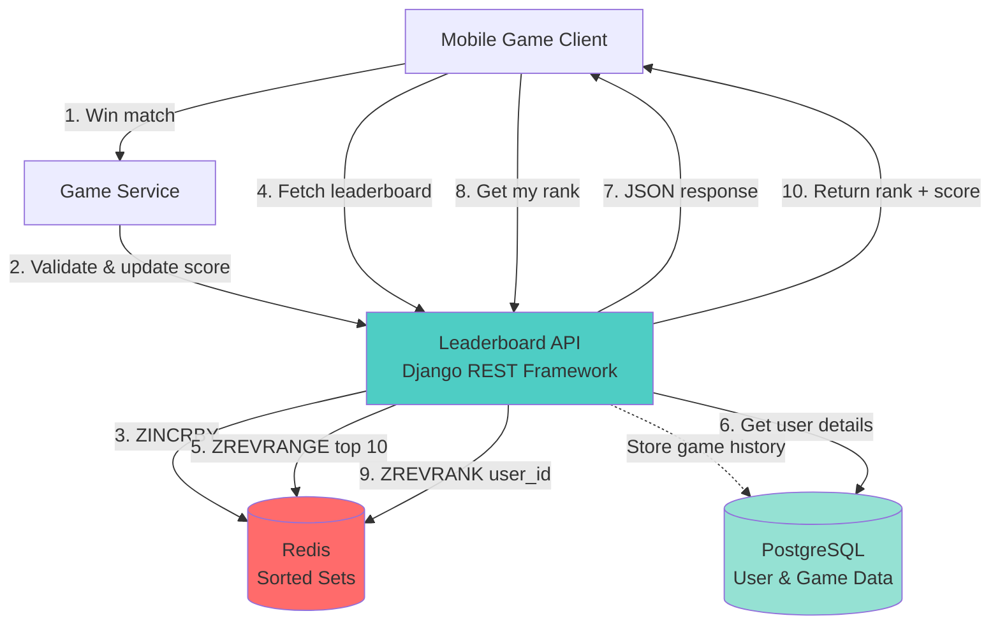
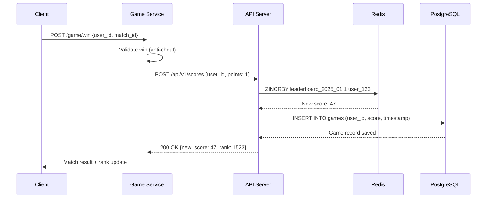
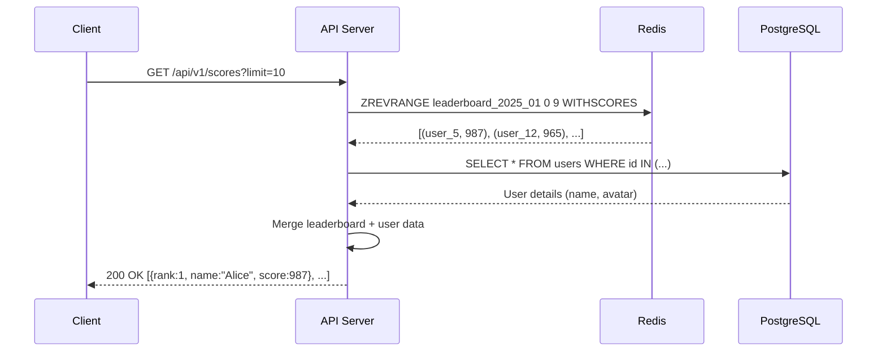
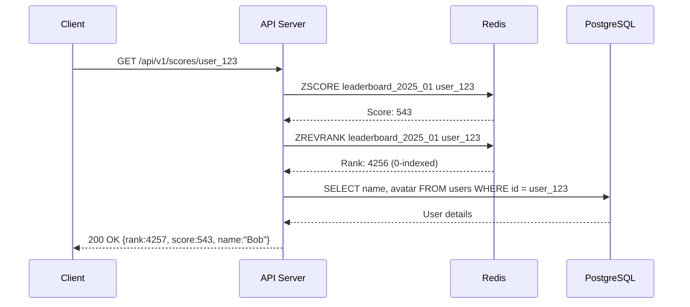

---
tags:
  - system-design
  - realtime-gaming-leaderboard
  - architecture
  - redis
  - django
created: 2025-12-31
related:
  - "[[00-analysis]]"
---

# Real-time Gaming Leaderboard — Architecture

## System Diagram



## High-Level Flow

### Flow 1: Player Wins a Match



### Flow 2: Fetch Top 10 Leaderboard



### Flow 3: Get Player's Rank



## Component Deep Dive

### 1. Game Service

**Purpose**: Validates match outcomes and triggers leaderboard updates
**Implementation**: `core/services/game_service.py`
**Simulates**: Server-authoritative game logic (e.g., Supercell's game servers)

> [!info] System Design Concept
> This demonstrates [[server-authoritative-architecture]]. Clients cannot directly update scores to prevent cheating (man-in-the-middle attacks). The game server validates wins before calling the leaderboard API.

**Key decisions**:
- Synchronous call to leaderboard API (could be async with message queue for scale)
- Simple validation: check if match exists and user participated
- Returns new rank to client immediately

**At scale**: Use Kafka to decouple game events from leaderboard updates, enabling multiple consumers (analytics, push notifications).

---

### 2. Leaderboard API (Django REST Framework)

**Purpose**: Exposes RESTful endpoints for score updates and queries
**Implementation**: `core/views.py` (viewsets) + `core/serializers.py`
**Simulates**: API Gateway (AWS) + microservice

> [!info] System Design Concept
> Demonstrates [[api-design]] with clear separation between game logic and leaderboard logic. Uses [[rest-principles]] with proper HTTP verbs and status codes.

**Key decisions**:
- POST /scores is internal API (game service only, requires auth token)
- GET endpoints are public (with rate limiting in production)
- Returns rank alongside score for better UX

**At scale**: Deploy behind load balancer (nginx/HAProxy), add API key authentication, implement rate limiting per user.

---

### 3. Redis Sorted Sets

**Purpose**: Primary data store for leaderboard with O(log n) operations
**Implementation**: `core/storage/redis_store.py`
**Simulates**: Redis Cluster (production)

> [!info] System Design Concept
> This is the heart of the system, demonstrating [[redis-sorted-sets]] and [[skip-list]] internals. Unlike a relational DB that sorts on every query, Redis maintains sort order during insertion.

**Data structure**:
- **Key**: `leaderboard_{YYYY}_{MM}` (e.g., `leaderboard_2025_01`)
- **Members**: User IDs (strings)
- **Scores**: Total wins (integers)

**Key operations**:
```python
# Increment user score by 1
redis.zincrby("leaderboard_2025_01", 1, "user_123")

# Get top 10 (descending order)
redis.zrevrange("leaderboard_2025_01", 0, 9, withscores=True)

# Get user's rank (0-indexed)
redis.zrevrank("leaderboard_2025_01", "user_123")

# Get user's score
redis.zscore("leaderboard_2025_01", "user_123")
```

**Time complexity**:
- Insert/Update: O(log n)
- Top K: O(log n + K)
- Get rank: O(log n)

**Persistence**:
- RDB snapshots every 5 minutes
- AOF (append-only file) for durability
- Read replica for failover

**At scale (500M DAU)**:
- Shard by score ranges (fixed partition)
- 65 GB total storage → 10 shards × 6.5 GB each
- Secondary cache (Redis hash) for user → shard mapping

---

### 4. PostgreSQL Database

**Purpose**: Persistent storage for user profiles and game history
**Implementation**: Django ORM models in `core/models.py`
**Simulates**: Amazon RDS (MySQL/Postgres)

> [!info] System Design Concept
> Demonstrates [[polyglot-persistence]] — using the right database for each use case. Redis for real-time leaderboard, Postgres for durable user data.

**Tables**:

```sql
-- User profiles
CREATE TABLE users (
    id UUID PRIMARY KEY,
    username VARCHAR(50) UNIQUE,
    display_name VARCHAR(100),
    avatar_url TEXT,
    created_at TIMESTAMP
);

-- Game history (audit log)
CREATE TABLE games (
    id BIGSERIAL PRIMARY KEY,
    user_id UUID REFERENCES users(id),
    score_earned INTEGER,
    match_id UUID,
    played_at TIMESTAMP DEFAULT NOW(),
    leaderboard_month VARCHAR(7) -- "2025-01"
);

-- Leaderboard snapshot (for recovery)
CREATE TABLE leaderboard_snapshots (
    user_id UUID,
    month VARCHAR(7),
    final_score INTEGER,
    final_rank INTEGER,
    PRIMARY KEY (user_id, month)
);
```

**Indexes**:
- `users.username` (unique, for login)
- `games.user_id, games.played_at` (for player history)
- `games.leaderboard_month` (for monthly aggregation)

**Recovery scenario**: If Redis crashes, rebuild leaderboard from `games` table:
```sql
SELECT user_id, COUNT(*) as score
FROM games
WHERE leaderboard_month = '2025-01'
GROUP BY user_id;
-- Then ZADD each user back to Redis
```

---

### 5. Leaderboard Service

**Purpose**: Business logic for score updates and ranking calculations
**Implementation**: `core/services/leaderboard_service.py`
**Simulates**: Dedicated microservice

> [!info] System Design Concept
> Follows [[separation-of-concerns]] — views handle HTTP, services handle business logic. Makes testing easier and enables reuse across different interfaces (REST API, GraphQL, CLI).

**Key methods**:

```python
class LeaderboardService:
    def update_score(user_id: str, points: int, month: str) -> dict:
        """
        Increment user score and return new rank.
        Uses Redis ZINCRBY + ZREVRANK.
        """

    def get_top_n(n: int, month: str) -> List[LeaderboardEntry]:
        """
        Fetch top N players.
        Uses Redis ZREVRANGE + Postgres for user details.
        """

    def get_user_rank(user_id: str, month: str) -> dict:
        """
        Get user's rank and score.
        Uses Redis ZREVRANK + ZSCORE.
        """

    def get_surrounding_players(user_id: str, month: str, offset: int = 4):
        """
        Get players ±offset positions around user.
        Calculates range and uses ZREVRANGE.
        """
```

**Bonus feature**: `get_surrounding_players` implements the ±4 positions requirement:
1. Get user's rank: `rank = ZREVRANK(...)`
2. Calculate range: `start = max(0, rank - 4)`, `end = rank + 4`
3. Fetch range: `ZREVRANGE(..., start, end)`

---

## Data Flow

### 1. Score Update Flow

1. **Client** sends match result to **Game Service**
2. **Game Service** validates win (checks match exists, user participated)
3. **Game Service** calls **Leaderboard API**: `POST /api/v1/scores`
4. **API** calls `LeaderboardService.update_score()`
5. **Service** executes `ZINCRBY leaderboard_2025_01 1 user_123` on **Redis**
6. **Service** inserts game record into **PostgreSQL** (audit log)
7. **Service** fetches new rank with `ZREVRANK`
8. **API** returns `{new_score: 47, rank: 1523}` to **Game Service**
9. **Game Service** sends rank update to **Client**

### 2. Leaderboard Query Flow

1. **Client** requests top 10: `GET /api/v1/scores?limit=10`
2. **API** calls `LeaderboardService.get_top_n(10, "2025-01")`
3. **Service** executes `ZREVRANGE leaderboard_2025_01 0 9 WITHSCORES` on **Redis**
4. **Redis** returns `[(user_5, 987), (user_12, 965), ...]`
5. **Service** queries **PostgreSQL**: `SELECT * FROM users WHERE id IN (...)`
6. **Service** merges leaderboard data + user details
7. **API** returns JSON array with rank, name, avatar, score

### 3. Monthly Rotation Flow

1. **Cron job** triggers at 00:00 on 1st of month
2. **Admin script** creates new sorted set: `leaderboard_2025_02`
3. **Admin script** copies `leaderboard_2025_01` to **PostgreSQL** `leaderboard_snapshots`
4. **Admin script** expires old sorted set after 7 days (or keeps for historical queries)
5. **API** automatically uses current month's sorted set

---

## API Endpoints

### POST /api/v1/scores

**Purpose**: Update user score after winning a match
**Auth**: Internal API (requires `X-Game-Service-Token` header)

**Request**:
```json
{
  "user_id": "550e8400-e29b-41d4-a716-446655440000",
  "points": 1
}
```

**Response** (200 OK):
```json
{
  "user_id": "550e8400-e29b-41d4-a716-446655440000",
  "new_score": 47,
  "rank": 1523,
  "month": "2025-01"
}
```

**Response** (400 Bad Request):
```json
{
  "error": "Invalid user_id or points value"
}
```

---

### GET /api/v1/scores

**Purpose**: Fetch top N players on leaderboard
**Auth**: Public (with rate limiting in production)

**Query params**:
- `limit`: Number of players to return (default: 10, max: 100)
- `month`: Leaderboard month (default: current month, format: `YYYY-MM`)

**Request**: `GET /api/v1/scores?limit=10&month=2025-01`

**Response** (200 OK):
```json
{
  "data": [
    {
      "rank": 1,
      "user_id": "550e8400-...",
      "username": "alice_94",
      "display_name": "Alice",
      "avatar_url": "https://cdn.example.com/avatars/alice.jpg",
      "score": 987
    },
    {
      "rank": 2,
      "user_id": "660f9511-...",
      "username": "bob_the_builder",
      "display_name": "Bob",
      "avatar_url": "https://cdn.example.com/avatars/bob.jpg",
      "score": 965
    }
  ],
  "total": 10,
  "month": "2025-01"
}
```

---

### GET /api/v1/scores/{user_id}

**Purpose**: Get specific user's rank and score
**Auth**: Public (could restrict to own user_id + friends in production)

**Request**: `GET /api/v1/scores/550e8400-e29b-41d4-a716-446655440000?month=2025-01`

**Response** (200 OK):
```json
{
  "user_id": "550e8400-e29b-41d4-a716-446655440000",
  "username": "alice_94",
  "display_name": "Alice",
  "rank": 4257,
  "score": 543,
  "month": "2025-01"
}
```

**Response** (404 Not Found):
```json
{
  "error": "User not found in leaderboard for month 2025-01"
}
```

---

### GET /api/v1/scores/{user_id}/surrounding

**Purpose**: Get players ±4 positions around user (bonus feature)
**Auth**: Public

**Query params**:
- `offset`: Number of positions above/below (default: 4, max: 10)
- `month`: Leaderboard month (default: current month)

**Request**: `GET /api/v1/scores/550e8400-e29b-41d4-a716-446655440000/surrounding?offset=2`

**Response** (200 OK):
```json
{
  "data": [
    {"rank": 4255, "username": "player_1", "score": 545},
    {"rank": 4256, "username": "player_2", "score": 544},
    {"rank": 4257, "username": "alice_94", "score": 543, "is_current_user": true},
    {"rank": 4258, "username": "player_3", "score": 542},
    {"rank": 4259, "username": "player_4", "score": 541}
  ],
  "user_rank": 4257,
  "month": "2025-01"
}
```

---

## Data Models

### Django Models

```python
from django.db import models
import uuid

class User(models.Model):
    """
    User profile model.

    Stores player information separate from leaderboard rankings.
    In production, this would be managed by an auth service.
    """
    id = models.UUIDField(primary_key=True, default=uuid.uuid4)
    username = models.CharField(max_length=50, unique=True, db_index=True)
    display_name = models.CharField(max_length=100)
    avatar_url = models.URLField(blank=True)
    created_at = models.DateTimeField(auto_now_add=True)

    class Meta:
        db_table = "users"
        ordering = ["username"]

    def __str__(self):
        return f"{self.display_name} (@{self.username})"


class Game(models.Model):
    """
    Audit log for all game matches.

    System Design Concept:
        - Enables leaderboard recovery from persistent storage
        - Supports analytics and player history queries
        - Timestamp allows replaying events in order

    At Scale:
        - Partition by month (time-series data)
        - Archive old months to cold storage (S3)
        - Use Cassandra for write-heavy workload
    """
    id = models.BigAutoField(primary_key=True)
    user = models.ForeignKey(User, on_delete=models.CASCADE, related_name="games")
    score_earned = models.IntegerField(default=1)  # Points from this match
    match_id = models.UUIDField()  # Reference to game service's match record
    played_at = models.DateTimeField(auto_now_add=True, db_index=True)
    leaderboard_month = models.CharField(max_length=7, db_index=True)  # "YYYY-MM"

    class Meta:
        db_table = "games"
        ordering = ["-played_at"]
        indexes = [
            models.Index(fields=["user", "-played_at"]),
            models.Index(fields=["leaderboard_month"]),
        ]

    def __str__(self):
        return f"{self.user.username} scored {self.score_earned} on {self.played_at}"


class LeaderboardSnapshot(models.Model):
    """
    Monthly leaderboard archives.

    Stores final rankings when month ends for historical queries.
    Generated by cron job on 1st of each month.
    """
    user = models.ForeignKey(User, on_delete=models.CASCADE)
    month = models.CharField(max_length=7)  # "YYYY-MM"
    final_score = models.IntegerField()
    final_rank = models.IntegerField()
    created_at = models.DateTimeField(auto_now_add=True)

    class Meta:
        db_table = "leaderboard_snapshots"
        unique_together = [["user", "month"]]
        ordering = ["month", "final_rank"]
```

---

## Redis Data Structures

### Sorted Set (Leaderboard)

**Key naming**: `leaderboard_{YYYY}_{MM}`

**Structure**:
```
Key: "leaderboard_2025_01"
Type: Sorted Set (ZSET)

Members (user_id) : Scores (wins)
----------------------------------
"550e8400-..." : 987
"660f9511-..." : 965
"770a0622-..." : 943
...
"aa1b1733-..." : 1
```

**TTL**: 90 days (kept for historical queries, then archived to S3)

### Hash (User Details Cache) - Optional Optimization

**Purpose**: Cache user details for top 10 to avoid DB queries

**Key naming**: `user_cache_{user_id}`

**Structure**:
```
Key: "user_cache_550e8400-..."
Type: Hash

Field          : Value
-------------------------
username       : "alice_94"
display_name   : "Alice"
avatar_url     : "https://..."
```

**TTL**: 1 hour (invalidate on profile update)

---

## Scaling Strategy (500M DAU)

### Problem at Scale

- **Storage**: 25M MAU × 26 bytes → 650 MB (manageable)
- **500M DAU**: 65 GB storage, 250K QPS
- **Single Redis bottleneck**: Max ~100K QPS per node

### Solution: Fixed Partition Sharding

```
Shard 1: scores 0-100     → Redis node 1
Shard 2: scores 101-200   → Redis node 2
...
Shard 10: scores 901-1000 → Redis node 10 (hot shard)
```

**Secondary cache** (Redis hash):
```
Key: user_shard_mapping
user_123 → shard_8 (score range 701-800)
```

**Top 10 query**: Always query highest shard (shard 10)

**User rank calculation**:
```python
def get_user_rank(user_id):
    shard_num = get_user_shard(user_id)  # From secondary cache
    local_rank = redis[shard_num].zrevrank(...)

    # Count players in higher shards
    higher_count = sum(
        redis[s].zcard(...) for s in range(shard_num + 1, 11)
    )

    return higher_count + local_rank + 1
```

**Shard migration**: When user's score increases and crosses boundary:
1. Remove from current shard: `ZREM`
2. Update secondary cache
3. Add to new shard: `ZADD`

---

## Monthly Leaderboard Rotation

**Cron job** (runs at 00:00:00 on 1st of month):

```python
# 1. Archive current month to Postgres
current_month = "2025_01"
leaderboard_data = redis.zrevrange(f"leaderboard_{current_month}", 0, -1, withscores=True)

for rank, (user_id, score) in enumerate(leaderboard_data, start=1):
    LeaderboardSnapshot.objects.create(
        user_id=user_id,
        month=current_month.replace("_", "-"),
        final_score=int(score),
        final_rank=rank
    )

# 2. Set expiration on old sorted set (7 days)
redis.expire(f"leaderboard_{current_month}", 7 * 24 * 60 * 60)

# 3. New month sorted set created automatically on first ZINCRBY
```

---

## Monitoring & Observability

**Key metrics**:
- Redis QPS (ZINCRBY, ZREVRANGE, ZREVRANK)
- Redis memory usage (should be ~650 MB)
- API latency (p50, p95, p99)
- Top 10 cache hit rate (if implemented)

**Alerts**:
- Redis memory > 1 GB
- API p99 latency > 200ms
- QPS approaching 100K (time to shard)

**Logging**:
- Every score update: `user_id, old_score, new_score, new_rank, latency`
- Top 10 fetches: `month, latency, cache_hit`
- Monthly rotation: `month, total_users, archive_time`

---

## Next Steps

Proceed with **Phase 3: Project Setup** to create:
1. Django project structure
2. Docker Compose with Redis + Postgres
3. Initial models and migrations
4. Requirements.txt with dependencies
